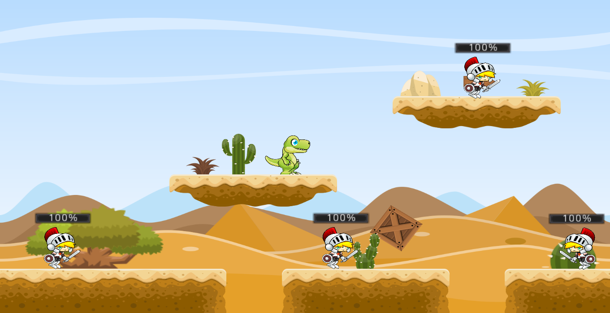

# Desert Legends

  

## Game description

  

**[Desert Legends](https://github.com/JA-Developer/Desert-Legends) is a sketch of a platform game developed on the Godot Engine software using the GDScript programming language, which is a language similar to Python.** In this game, the player is a dinosaur who travels through a desert shooting fireballs at Knights with swords. To move around the world, the player must use the keys W, A, S, and D, as shown in the following picture:

  

To attack enemies, the player must press the space bar, as shown in the following picture:

  

## Try it yourself

You can play a demo of the game at the following link: [Desert Legends](https://desertlegends.000webhostapp.com/).

## Contributing

Desert Legends was developed by [JA-Developer](https://github.com/JA-Developer) using Godot Engine. The sprites and assets where provided by [Game Art 2D](https://www.gameart2d.com/).